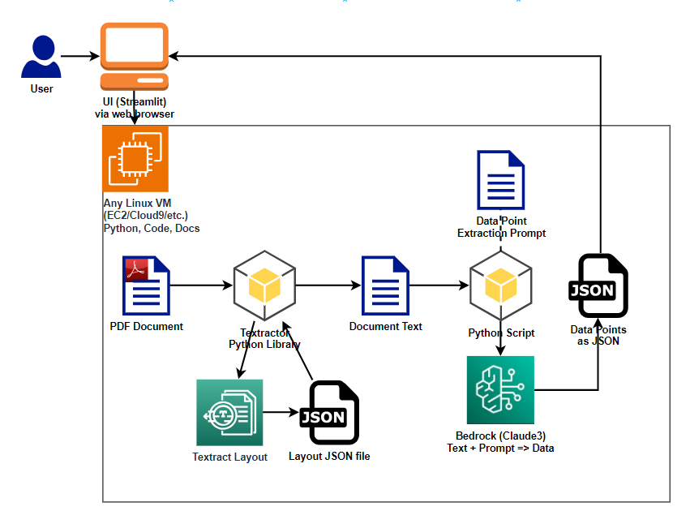
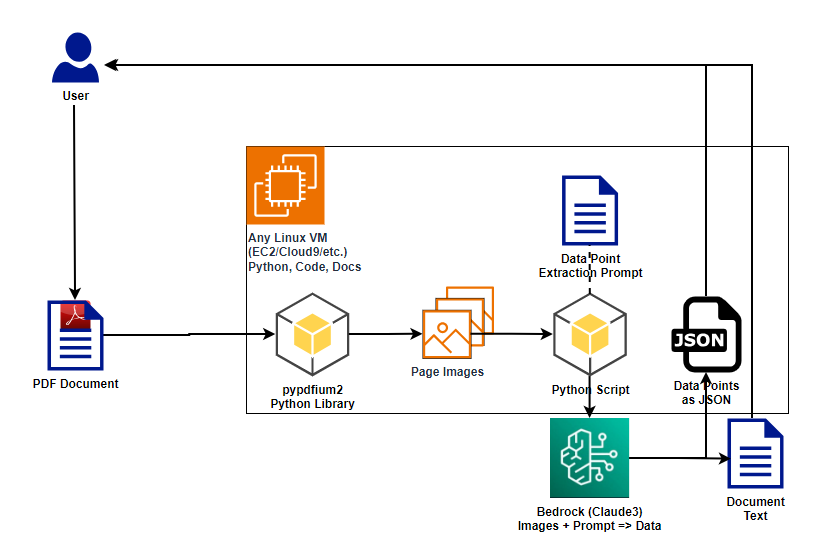
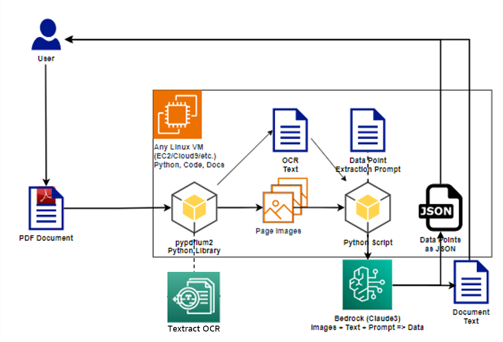

# Intelligent Mutual Fund Prospectus Document Processing 📈🤖

[](https://star-history.com/#aws-samples/generative-ai-financial-services-samples)
[](https://opensource.org/licenses/MIT)

Welcome to our state-of-the-art Intelligent Mutual Fund Prospectus Document Processing tailored specifically for financial services. By leveraging a unique and advanced workflow, our system ensures precise, context-aware responses, making it a frontrunner in AI-driven financial communication solutions.


# Features 🌟

- **Mutual Fund Prospectus-centric RAG Workflow**: A robust model that understands the intricacies of the Mutual Fund Prospectus.
- **Pre-summarization**: Ensure detailed and context-aware responses every time.
- **Seamless Integration**: Integrated with tools like Langchain, Streamlit, and Bedrock for a seamless experience.

# Project Diagram 📊 

## Textract OCR passing text to Claude:



## Claude Vision alone:



## Textract OCR passing text to Claude Vision:



# Run in AWS 🎯

## Prerequisites
To interact with the models, you need to [request access to the models in the region you will use](https://console.aws.amazon.com/bedrock/home?#/modelaccess)*. Make sure to read and accept the end-user license agreements or EULA.

## Deployment

The solution is deployed using an AWS CloudFormation template with Amazon EC2. To deploy the solution, use one of the following CloudFormation templates and follow the instructions below.

| AWS Region | AWS CloudFormation Template URL |
|:-----------|:----------------------------|
| us-east-1 (N. Virginia) |<a href="https://console.aws.amazon.com/cloudformation/home?region=us-east-1#/stacks/new?stackName=llamacpp&templateURL=" target="_blank">Launch stack</a> |
| us-west-2 (Oregon) |<a href="https://console.aws.amazon.com/cloudformation/home?region=us-west-2#/stacks/new?stackName=llamacpp&templateURL=" target="_blank">Launch stack</a> |

This CloudFormation template launches an EC2 instance that includes all dependencies for hosting an streamlit application with Intelligent Document Processing workflows.

1. Click on one of the links above to deploy the solution via CloudFormation in your AWS account. 

2. Click the Upload a template file bottom and then upload the [deployment.yaml](cloudformation/deployment.yaml). Click the orange Next button located in the bottom right corner of the console to configure the deployment.

3. Set a stack name, and you can either provider your own `VPC ID` or configure the CIDR Blocks to create a new VPC.

4. Select your desired EC2 instance type.

5. Once you have decided on a stack name, and configured the parameters click Next to continue.

6. On the next step, Configure stack options, leave all values as they are and click Next to continue.

7. On the Review step

    a. Check the three boxes under Capabilities and transforms to acknowledge the template will create IAM resources and leverage transforms.

    b. Click the Create stack button located at the bottom of the page to deploy the template.

    The stack should take around 10 minutes to deploy.

7. Open the generated **WebUiURL** Url from outputs above i.e. `http:xxx.xxx.xxx.xxx`. **Note:** The app uses *http* requests to communicate with the backend server rather than *https* requests.

8. Go to Cognito, select the User Pool created by CloudFormation and create a new user.

9. Login with the user and password created in Cognito.

# Run Locally 💻

## Intelligent Mutual Fund Prospectus Document Processing Demo

This repository beautifully marries the capabilities of:
1. **Langchain**: Advanced linguistic chains and text parsing.
2. **Streamlit**: An intuitive platform for crafting custom ML tools.
3. **Bedrock**: Crafting complex ML structures with ease.

## Pre-Requisites

### S3 Bucket

Please create a S3 Bucket with a unique name and set an env variable called "BUCKET_NAME". If you'd like to use the AWS CLI, you can run the following command to create a S3 bucket:

```
BUCKET_NAME=<TYPE YOUR BUCKET NAME>
aws s3 mb s3://$BUCKET_NAME
```

Then you can set env. var as:

```
export BUCKET_NAME=$BUCKET_NAME
```

### Cognito Authentication

Please create a User Pool with a unique name and store the "pool_id", "app_client_id", and "app_client_secret" in Secrets Manager. Then save the Secrets ID as an env variable called "SECRET_NAME" before running `run.sh`.

Then you can set env. var as:

```
export SECRET_NAME=<YOUR SECRET NAME>
```

## Configure AWS command line and set credentials and region

```
aws configure
and/or
aws configure set region us-west-2
```
(or any other region where enabled Bedrock to run the Anrhtopic Claude models you want to test)

## Install

```bash
conda update conda -c conda-canary
conda config --set channel_priority flexible
conda create --name financialqaenv -c conda-forge python=3.10.6
conda activate financialqaenv

pip install --upgrade pip
pip install --upgrade -r requirements.txt
```

## Run

Before running the application, please ensure you have access to Amazon Bedrock and its required models. See [here](https://docs.aws.amazon.com/bedrock/latest/userguide/setting-up.html) for more info.

Also, to setup your AWS credentials, see this [reference](https://docs.aws.amazon.com/cli/latest/userguide/cli-chap-welcome.html) for AWS Command Line Interface and getting started with authentication and access credentials.

Launch the Streamlit application:

```bash
./run.sh
```

Or run the application using the streamlit command directly as follows:

```bash
streamlit run app.py
```

The application will pick your default AWS credentials in this case.


### Known Issues

Should you encounter the "Killed streamlit" message during highlighted tokens computation, it's likely due to resource constraints. Opt for a more powerful instance if this occurs.

# Running with Containers 🐳

To utilize containers, proceed as follows:

1. **Build the Docker Image**:
```bash
docker build -t pdf-advanced-rag-financial:latest .
```

2. **Run the Container** make sure to replace <YOUR_VALUES> with your actual AWS credentials:

```bash
docker run -p 8501:8501 \
   -e AWS_ACCESS_KEY_ID='<YOUR_ACCESS_KEY>' \
   -e AWS_SECRET_ACCESS_KEY='<YOUR_SECRET_KEY>' \
   -e AWS_DEFAULT_REGION='<YOUR_DEFAULT_REGION>' \   
   pdf-advanced-rag-financial:latest

```

Upon successful execution, visit `http://localhost:8501` to access the Streamlit app running within your Docker container.

If you prefer to use the `docker-compose.yml`, please run as follows:

1. Build the container image.

```bash
docker-compose build --no-cache
```

2. Start the container image.
```bash
docker-compose up
```

If you want to run in an AWS EC2, you can do as follows:

```bash
nohup streamlit run app.py &
```
This will run your streamlit app in the background and log to `nohup.out`.

Also, you could run the container in AWS EC2. In detached mode:

```bash
docker-compose up -d
```

In either cases, please note your EC2 url and ensure your streamlit is exposed to view the app. You might need all the necessary permissions and settings for this.

# Project Structure 🌲

Our project follows a clear and intuitive structure to ensure ease of navigation:

- `run.sh`: This shell script acts as the entry point for our application. It's tailored to initialize the Streamlit app.
  
- `app.py`: The heart of our application. This Python script handles the core logic, interfaces with the RAG model, and serves responses. Dive into it to understand the intricate workings of our advanced RAG workflow.

To make the most out of our project, familiarize yourself with these key components and their interplay.

```
├─ intelligent-mutual-fund-prospectus-document-processing/        
   ├── assets/
   ├── data_handlers/
   ├── docs/
   ├── labels/              
   ├── langchain_handler/            
   ├── utils/
   ├── .dockerignore
   ├── .gitignore
   ├── app.py             
   ├── config.yml
   ├── docker-compose.yml
   ├── Dockerfile
   ├── README.md
   ├── requirements-dev.txt
   ├── requirements.txt
   └── run.sh 
```

# Authors

- [Dayo Oguntoyinbo](https://www.linkedin.com/in/iamdayo/)
- [Kosta Belz](https://ca.linkedin.com/in/bkostya)
- [Max Winter](https://www.linkedin.com/in/maxwinter/)
- [Rubén Afonso](https://www.linkedin.com/in/rubenafonso/)
- [Samuel Baruffi](https://www.linkedin.com/in/samuelbaruffi/)
- [Liam Knowles](https://www.linkedin.com/in/liam-knowles)
- [Armando Diaz](https://www.linkedin.com/in/armando-diaz-gonzalez/)

# Contributors

[](https://github.com/aws-samples/generative-ai-financial-services-samples/graphs/contributors)
