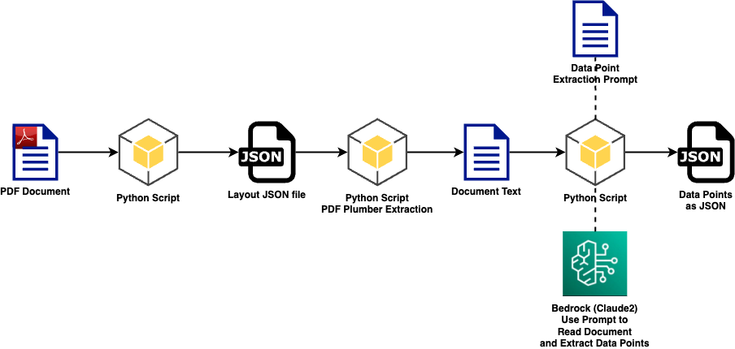

# Intelligent Mutual Fund Prospectus Document Processing 📈🤖

[](https://star-history.com/#aws-samples/generative-ai-financial-services-samples)
[](https://opensource.org/licenses/MIT)

Welcome to our state-of-the-art Intelligent Mutual Fund Prospectus Document Processing tailored specifically for financial services. By leveraging a unique and advanced workflow, our system ensures precise, context-aware responses, making it a frontrunner in AI-driven financial communication solutions.


# Features 🌟

- **Mutual Fund Prospectus-centric RAG Workflow**: A robust model that understands the intricacies of the Mutual Fund Prospectus.
- **Pre-summarization**: Ensure detailed and context-aware responses every time.
- **Seamless Integration**: Integrated with tools like Langchain, Streamlit, and Bedrock for a seamless experience.

# Project Diagram 📊 



# Run Locally 💻

## Intelligent Mutual Fund Prospectus Document Processing Demo

This repository beautifully marries the capabilities of:
1. **Langchain**: Advanced linguistic chains and text parsing.
2. **Streamlit**: An intuitive platform for crafting custom ML tools.
3. **Bedrock**: Crafting complex ML structures with ease.

## Install

```bash
conda update conda -c conda-canary
conda config --set channel_priority flexible
conda create --name financialqaenv -c conda-forge python=3.10.6
conda activate financialqaenv

pip install --upgrade pip
pip install --upgrade -r requirements.txt
```

## Run

Before running the application, please ensure you have access to Amazon Bedrock and its required models. See [here](https://docs.aws.amazon.com/bedrock/latest/userguide/setting-up.html) for more info.

Also, to setup your AWS credentials, see this [reference](https://docs.aws.amazon.com/cli/latest/userguide/cli-chap-welcome.html) for AWS Command Line Interface and getting started with authentication and access credentials.

Launch the Streamlit application:

```bash
./run.sh
```

Or run the application using the streamlit command directly as follows:

```bash
streamlit run app.py
```

The application will pick your default AWS credentials in this case.


### Known Issues

Should you encounter the "Killed streamlit" message during highlighted tokens computation, it's likely due to resource constraints. Opt for a more powerful instance if this occurs.

# Running with Containers 🐳

To utilize containers, proceed as follows:

1. **Build the Docker Image**:
```bash
docker build -t pdf-advanced-rag-financial:latest .
```

2. **Run the Container** make sure to replace <YOUR_VALUES> with your actual AWS credentials:

```bash
docker run -p 8501:8501 \
   -e AWS_ACCESS_KEY_ID='<YOUR_ACCESS_KEY>' \
   -e AWS_SECRET_ACCESS_KEY='<YOUR_SECRET_KEY>' \
   -e AWS_DEFAULT_REGION='<YOUR_DEFAULT_REGION>' \   
   pdf-advanced-rag-financial:latest

```

Upon successful execution, visit `http://localhost:8501` to access the Streamlit app running within your Docker container.

If you prefer to use the `docker-compose.yml`, please run as follows:

1. Build the container image.

```bash
docker-compose build --no-cache
```

2. Start the container image.
```bash
docker-compose up
```

If you want to run in an AWS EC2, you can do as follows:

```bash
nohup streamlit run app.py &
```
This will run your streamlit app in the background and log to `nohup.out`.

Also, you could run the container in AWS EC2. In detached mode:

```bash
docker-compose up -d
```

In either cases, please note your EC2 url and ensure your streamlit is exposed to view the app. You might need all the necessary permissions and settings for this.

# Project Structure 🌲

Our project follows a clear and intuitive structure to ensure ease of navigation:

- `run.sh`: This shell script acts as the entry point for our application. It's tailored to initialize the Streamlit app.
  
- `app.py`: The heart of our application. This Python script handles the core logic, interfaces with the RAG model, and serves responses. Dive into it to understand the intricate workings of our advanced RAG workflow.

To make the most out of our project, familiarize yourself with these key components and their interplay.

```
├─ intelligent-mutual-fund-prospectus-document-processing/        
   ├── assets/
   ├── data_handlers/
   ├── docs/
   ├── labels/              
   ├── langchain_handler/            
   ├── utils/
   ├── .dockerignore
   ├── .gitignore
   ├── app.py             
   ├── config.yml
   ├── docker-compose.yml
   ├── Dockerfile
   ├── README.md
   ├── requirements-dev.txt
   ├── requirements.txt
   └── run.sh 
```

# Authors

- [Dayo Oguntoyinbo](https://www.linkedin.com/in/iamdayo/)
- [Kosta Belz](https://ca.linkedin.com/in/bkostya)
- [Max Winter](https://www.linkedin.com/in/maxwinter/)
- [Rubén Afonso](https://www.linkedin.com/in/rubenafonso/)
- [Samuel Baruffi](https://www.linkedin.com/in/samuelbaruffi/)

# Contributors

[](https://github.com/aws-samples/generative-ai-financial-services-samples/graphs/contributors)
