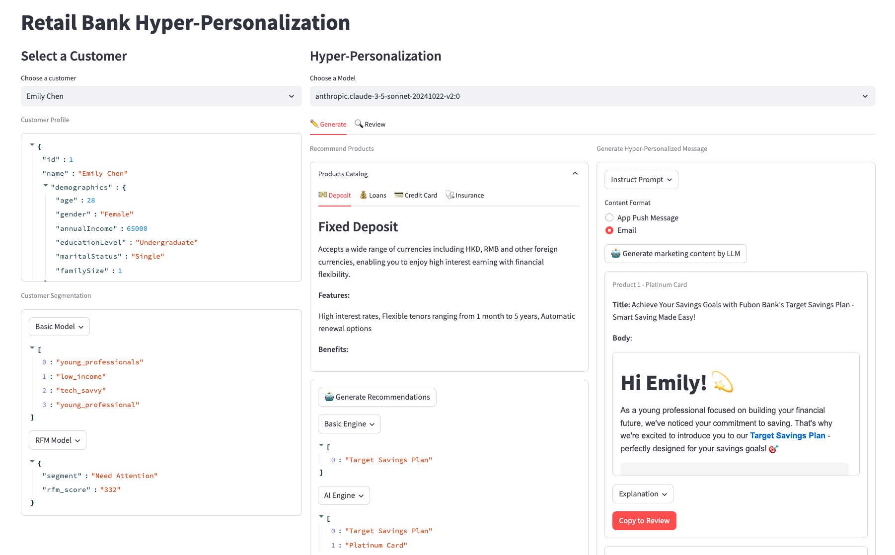

# Retail Bank Hyper-Personalization 👨‍👩‍👧‍👦

This sample demonstrates how to leverage Generative AI for hyperpersonalization in retail banking, by delivering tailored marketing messages to individual customers at scale. Additionally, it illustrates how GenAI's reasoning capabilities can be employed for compliance review, ensuring that personalized marketing content adheres to brand guidelines and regulatory requirements.



## 1. Key Features

This demo showcases following intelligence powered by AWS Bedrock.
- **Product Recommendations**: Generates personalized product recommendations using both basic and AI-driven models.
- **Marketing Content Generation**: Creates hyper-personalized marketing messages based on customer data and recommended products.
- **Compliance Review**: Facilitates reviewing generated content to ensure compliance with brand guidelines.

## 2. Workflow Diagram


## 3. Getting started

Before running the application code, please complete following setup:
1. Clone the repo
2. Navigate to the working directory

```bash
cd aws-generative-ai-financial-services-examples/retail-bank-hyper-personalization
```

3. It is recommended to use a virtual environment (preferably a `conda` virtual environment, due to some packages dependencies).
4. If you are on any of the following operating systems, do the following:
   - **Windows**: Download and install the [Anaconda Distribution for Windows](https://docs.anaconda.com/free/anaconda/install/windows/).
   - **Mac**: Follow the instruction for [MacOS here](https://docs.anaconda.com/free/anaconda/install/mac-os/)
   - **Linux**: Please the installation link for Linux [here](https://docs.anaconda.com/free/anaconda/install/linux/). Please be mindful of the flavour of Linux distribution you have.

### 3.1 Managed Environment (conda preferred)

After the Anaconda Distribution installation is complete. Do the following:

1. Create a conda working environment as shown below:

```bash
conda create --name genai-fsi-demo python=3.11 -y
```

2. Then activate the environment

```bash
conda activate genai-fsi-demo
```

### 3.2 Using Conda environment with `requirements.txt`

1. Installing needed packages
Use the `requirements.txt` for packages installation as shown below.

```bash
pip install -r requirements.txt
```

> [!WARNING]
> You can use the native Python environment <i>venv</i> but be mindful of the package dependencies.


### 3.3 AWS Configuration
Before running the application, please ensure you have access to Amazon Bedrock and its required models in region **us-west-2**. See [here](https://docs.aws.amazon.com/bedrock/latest/userguide/setting-up.html) for more info.

Also, to setup your AWS credentials, see this [reference](https://docs.aws.amazon.com/cli/latest/userguide/cli-chap-welcome.html) for AWS Command Line Interface and getting started with authentication and access credentials.

If the above steps were successful, you should be able to continue the next steps.


## 4. Running the Application

### 4.1 Locally

Launch the Streamlit application:

```bash
./run.sh
```

Or run the application using the streamlit command directly as follows:

```bash
streamlit run app.py
```

The application will pick your default AWS credentials in this case.

### 4.1 With Containers 🐳

```bash
docker run -p 8501:8501 \
   -e AWS_ACCESS_KEY_ID='<YOUR_ACCESS_KEY>' \
   -e AWS_SECRET_ACCESS_KEY='<YOUR_SECRET_KEY>' \
   -e AWS_DEFAULT_REGION='<YOUR_DEFAULT_REGION>' \   
   pdf-advanced-rag-financial:latest

```

Upon successful execution, visit `http://localhost:8501` to access the Streamlit app running within your Docker container.

If you prefer to use the `docker-compose.yml`, please run as follows:

1. Build the container image.

```bash
docker-compose build --no-cache
```

2. Start the container image.
```bash
docker-compose up
```

If you want to run in an AWS EC2, you can do as follows:

```bash
nohup streamlit run app.py &
```
This will run your streamlit app in the background and log to `nohup.out`.

Also, you could run the container in AWS EC2. In detached mode:

```bash
docker-compose up -d
```

In either cases, please note your EC2 url and ensure your streamlit is exposed to view the app. You might need all the necessary permissions and settings for this.


# Project Structure 🌲

Our project follows a clear and intuitive structure to ensure ease of navigation:

- `run.sh`: This shell script acts as the entry point for our application. It's tailored to initialize the Streamlit app.
  
- `app.py`: The heart of our application. This Python script handles the core logic, interfaces, and serves responses. Dive into it to understand the intricate workings of the hyper-personalization workflow.

```
├─ retail-bank-hyper-personalization/        
   ├── data/
   ├── docs/          
   ├── utils/
   ├── .dockerignore
   ├── .gitignore
   ├── app.py             
   ├── docker-compose.yml
   ├── Dockerfile
   ├── README.md
   ├── requirements-dev.txt
   ├── requirements.txt
   └── run.sh 
```

# Authors

- [Tony Wong](https://www.linkedin.com/in/tonywsf/)